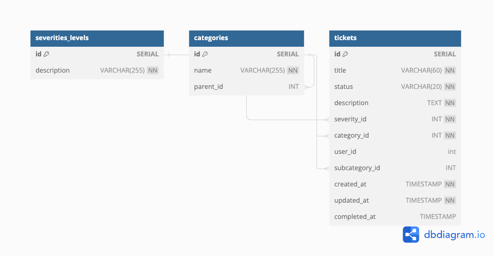
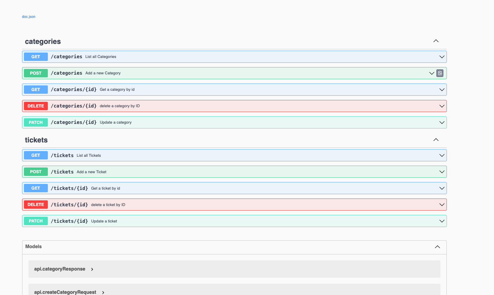

# Golang Meli Api
 
## Desc:
Aplicação CRUD para gerenciamento de tickets, com categorias e subcategorias, severity e integracao com jsonplaceholder simulando tabela user


## Tabela de Conteudo

1. [Requisitos](#requisitos)
2. [Database](#database)
3. [Instalacao](#instalacao)
    * [Requsitos](#requisitos)
    * [Clone o projeto](#clone-project)
    * [Collection Postman](#collection-postman)
    * [Dependencias](#dependencies)
    * [Tests ](#tests)
    * [Rodar Aplicacao ](#rodar-aplicacao)
    * [Rodar Com Docker ](#rodar-com-docker)
4. [Endpoints](#endpoints)
5. [Referencia Api](#documentação-da-api-de-tickets)
    * [Criar Ticket](#criar-ticket)
    * [Listar Ticket](#listar-tickets)
    * [Obter Ticket](#obter-ticket)
    * [Deletar Ticket](#deletar-ticket)
    * [Atualizar Ticket](#atualizar-ticket)
6. [Metricas de Negocio](#documentação-da-api-de-tickets)
   * [Criar Ticket](#criar-ticket)
7. [Autor](#autor)


## Tecnologias Utilizadas
- Docker
- Golang
- Gin
- Postgres
- Sqlx
- TestContainers
- Testify
- Zap logger
- Viper
- Swagger
- Validator

## Requisitos
- Docker
- Golang
- Make
- Golang Migrate

## Database:
Na tabela ticket temos o user_id simulando uma tabela de usuario integrando com os usuarios do jsonplaceholder



# Instalacao

### Clone Project
```bash
git clone https://github.com/moura95/meli-api
cd meli-challenge-api
```

##  Collection Postman
docs/meliapi_collection.json

## Dependencies
Instalar Dependencias
```bash
  go mod tidy
```

## Tests
```bash
make test
```

```bash
go test -v ./...
```

## Rodar Aplicacao
Iniciar Servico

```bash
  make start
```

```bash
  go run cmd/main.go
```

## Rodar Com Docker
Docker esta configurado para subir imagem do banco de dados, criar as tabelas e inserir registros, estou utilizando a imagem do golang-migrate para executar minhas migracoes, alem de subir a api da aplicacao.

```bash
docker-compose up
```

Swagger:

http://localhost:8080/swagger/index.html

# Documentação da API de Tickets
## Endpoints

## Criar Ticket

**`POST /tickets/`**

### Descrição

Cria um novo ticket.

### Parâmetros

**Headers**:

| Parâmetro      | Tipo     | Descrição              |
| :------------: | :------: | :--------------------- |
| `Content-Type` | `string` | `application/json`     |

**Body parameters**:

| Parâmetro      | Tipo      | Descrição                                 |
| :------------: | :-------: | :---------------------------------------- |
| `title`        | `string`  | Título do ticket. `Required`              |
| `description`  | `string`  | Descrição do ticket. `Required`           |
| `severity_id`  | `int`     | ID da severidade. `Required`              |
| `category_id`  | `int`     | ID da categoria. `Required`               |
| `subcategory_id` | `int`   | ID da subcategoria. `Optional`            |

### Exemplo de pedido

**Body**:

```json
{
  "title": "Erro no sistema",
  "description": "O sistema apresenta um erro ao tentar salvar.",
  "severity_id": 2,
  "category_id": 1,
  "subcategory_id": 4
}
```

Response:
```json
{
  "error": "",
  "data": {
    "ID": 11,
    "Title": "Erro no sistema",
    "Status": "OPEN",
    "Description": "O sistema apresenta um erro ao tentar salvar.",
    "SeverityID": 2,
    "CategoryID": 1,
    "SubcategoryID": 4,
    "CreatedAt": "2024-08-05T11:51:01.816297Z",
    "UpdatedAt": "2024-08-05T11:51:01.816297Z",
    "CompletedAt": null
  }
}
```


## Listar Tickets

**`GET /tickets/`**

### Descrição

Lista todos os tickets.

### Parâmetros

Não há parâmetros.


### Códigos de estado de resposta HTTP

| Código | Descrição |
| :----: | :-------- |
| **200** | Tickets listados com sucesso. |
| **500** | Erro interno do servidor. |

### Exemplo de resposta

**Body**:

```json
[
  {
    "id": 1,
    "title": "Erro no sistema",
    "status": "OPEN",
    "description": "O sistema apresenta um erro ao tentar salvar.",
    "severity_id": 2,
    "category_id": 1,
    "user_id": 5,
    "subcategory_id": 3,
    "created_at": "2023-07-15T14:48:00.000Z",
    "updated_at": "2023-07-15T14:48:00.000Z",
    "completed_at": null
  },
  {
    "id": 2,
    "title": "Problema de login",
    "status": "DONE",
    "description": "Usuários não conseguem fazer login.",
    "severity_id": 1,
    "category_id": 2,
    "user_id": 6,
    "subcategory_id": null,
    "created_at": "2023-07-16T10:15:00.000Z",
    "updated_at": "2023-07-16T11:00:00.000Z",
    "completed_at": "2023-07-16T11:00:00.000Z"
  }
]
```


## Obter Ticket

**`GET /tickets/{id}/`**

### Descrição

Obtém um ticket específico pelo seu ID.

### Parâmetros

**Path parameters**:

| Parâmetro | Tipo  | Descrição        |
| :-------: | :---: | :--------------- |
| `id`      | `int` | ID do ticket. `Required` |


### Códigos de estado de resposta HTTP

| Código | Descrição |
| :----: | :-------- |
| **200** | Ticket obtido com sucesso. |
| **404** | Ticket não encontrado. |
| **500** | Erro interno do servidor. |

### Exemplo de resposta

**Body**:

```json
{
  "id": 1,
  "title": "Erro no sistema",
  "status": "OPEN",
  "description": "O sistema apresenta um erro ao tentar salvar.",
  "severity_id": 2,
  "category_id": 1,
  "user_id": 5,
  "subcategory_id": 3,
  "created_at": "2023-07-15T14:48:00.000Z",
  "updated_at": "2023-07-15T14:48:00.000Z",
  "completed_at": null
}
```

## Deletar Ticket

**`DELETE /tickets/{id}/`**

### Descrição

Deleta um ticket específico pelo seu ID.

### Parâmetros

**Path parameters**:

| Parâmetro | Tipo  | Descrição        |
| :-------: | :---: | :--------------- |
| `id`      | `int` | ID do ticket. `Required` |


### Códigos de estado de resposta HTTP

| Código | Descrição |
| :----: | :-------- |
| **204** | Ticket deletado com sucesso. |
| **404** | Ticket não encontrado. |
| **500** | Erro interno do servidor. |


## Atualizar Ticket

**`PATCH /tickets/{id}/`**

### Descrição

Atualiza um ticket específico pelo seu ID.

### Parâmetros

**Headers**:

| Parâmetro      | Tipo     | Descrição              |
| :------------: | :------: | :--------------------- |
| `Content-Type` | `string` | `application/json`     |

**Path parameters**:

| Parâmetro | Tipo  | Descrição        |
| :-------: | :---: | :--------------- |
| `id`      | `int` | ID do ticket. `Required` |

**Body parameters**:

| Parâmetro        | Tipo     | Descrição                       |
| :--------------: | :------: |:--------------------------------|
| `title`          | `string` | Título do ticket. `Optional`    |
| `description`    | `string` | Descrição do ticket. `Optional` |
| `status`         | `string` | Status do ticket. `Optional`    |
| `severity_id`    | `int`    | ID da severidade. `Optional`    |
| `category_id`    | `int`    | ID da categoria. `Optional`     |
| `user_id`        | `int`    | ID do usuário. `Optional`       |
| `subcategory_id` | `int`    | ID da subcategoria. `Optional`  |

### Exemplo de pedido


**Body**:

```json
{
  "title": "Erro no sistema atualizado",
  "description": "A descrição foi atualizada.",
  "status": "IN_PROGRESS",
  "severity_id": 2,
  "category_id": 1,
  "user_id": 5,
  "subcategory_id": 3
}
```
### Exemplo de resposta
```json

{
"id": 1,
"title": "Erro no sistema atualizado",
"status": "IN_PROGRESS",
"description": "A descrição foi atualizada.",
"severity_id": 2,
"category_id": 1,
"user_id": 5,
"subcategory_id": 3,
"created_at": "2023-07-15T14:48:00.000Z",
"updated_at": "2023-07-20T12:00:00.000Z",
"completed_at": null
}
```

## Metricas de Negocio
- Número de Tickets em Aberto

- Total de tickets que ainda não foram resolvidos ou fechados.
- Número de Tickets Críticos

- Número de Tickets Finalizados

- Total de tickets que foram resolvidos e fechados com sucesso.
- Total de Tickets por Dia/Semana/Mês

- Quantidade total de tickets criados em um dia, semana ou mês específico. Ajuda a entender a carga de trabalho e a demanda ao longo do tempo.
- Tempo Médio de Resolução

- Tempo médio necessário para resolver e fechar um ticket desde a sua abertura. Pode ser segmentado por categoria ou severidade.
- Taxa de Resolução no Prazo

- Número de Tickets por Categoria/Subcategoria


- Percentual de tickets que foram reabertos após terem sido fechados, indicando possíveis problemas na resolução inicial.
- Tempo Médio de Atendimento


## Autor
* [Guilherme Moura.](https://www.linkedin.com/in/guilherme-moura95/) - Engenheiro de Software.